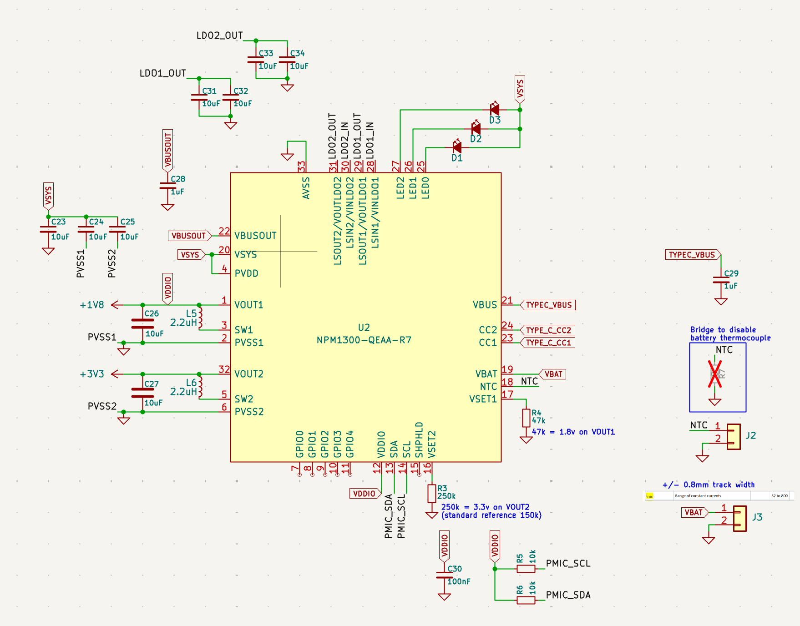

// design constraints
// debugging hardfault

## hardware design
![[Pasted image 20260118231058.png|500]]
I ordered these boards right before the holidays in 2025, and i finally got them in my hands in January. I was very excited about this design working out, but after powering and testing the chips i quickly remembered how it felt when i worked with my first design - an RP2040 board and how the first bring-up, especially with a complex layout, will always be stressful and might not go as well as you thought. A cute carpenter [frog](https://github.com/localcc) whispered to me the idea, a room thermostat with home-assistant support, with a cute E-Ink screen for displaying data, a knob for setting target temperature and sensors for periodic measurements.

//
// sketch the case!!
//

The final doodad will be housed in a small cube, with a temperature-set knob on top, usb-c port on one side for charging, holes on the opposite side for sensors and a cute display at the front. 
When i first started laying out the design on it i knew i would be busy in Kicad for a while, but i didn't realize what i was getting into until i started going through the datasheet of the microcontroller, first of all it's a myriad of pages - 980 to be exact - to give you a short introduction: the main star of the show is the NRF52840, one of nordic semiconductors' most popular when it comes to low-power Bluetooth SoCs, the board also features a PMIC (Power management IC) - specifically the NPM1300 which is also by nordic - for power supply and battery charging, a BME280 temperature and humidity sensor, headers for a rotary encoder and lastly, a flex cable connector for the E-ink display. Choosing all the components took a while, as ideas kept coming up but it was all built on top of knowing i would use the nrf52840, the rotary encoder and BME280 came later.
Getting back to the main point, we can quickly see why there's so many pages, the block diagram shows us a complete overview of the peripherals present, most of which we'll use, the sections of most interest to me for hardware design and troubleshooting were [Chapter 7 Hardware layout](), [Section 6.35 USBD]() and [Chapter 5 Power and clock management]().

This is how it started, laying out the schematic bit by bit, i usually start with components handling power buses.

Following Nordic semiconductors' hardware design guide and reference pcb layout was quite useful here and meant i got it all laid out pretty quickly.

## troubleshooting

![[Pasted image 20260119025034.png|500]]
My first tests with the board went alright, my setup consisted of an nRF9161-DK as a debugger and a random devboard as a power supply, i did not mention but i chose not to populate the PMIC as well as a few other components so i could cut costs for the first batch, so i had to do with what we have laying around.
![[Pasted image 20260119032905.png|270]]![[Pasted image 20260119033354.png|300]]
I placed various test-points around the board, allowing me to check voltage levels and current consumption on the different power rails.

## development environment setup

// rust
// embassy
// probe-rs-tools
// openocd and picoprobe firmware
// nrf52840-dk

## Chasing the power path

![[Pasted image 20260119031847.png|500]]

![[Pasted image 20260118174323.png]]
![[Pasted image 20260118174339.png]]
// Cortex-m core locked up
// Hot-aired one of the boards
// final solution
// going through testing all the boards
// graphing RSSI and writing a parser for BLEHero

