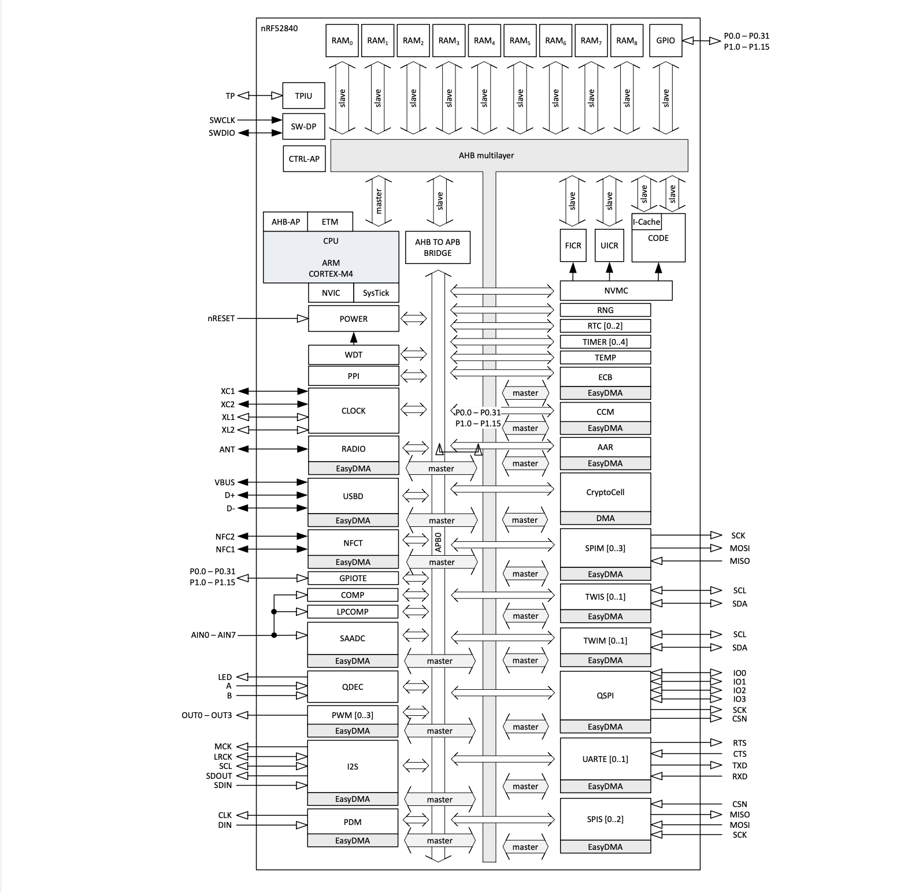
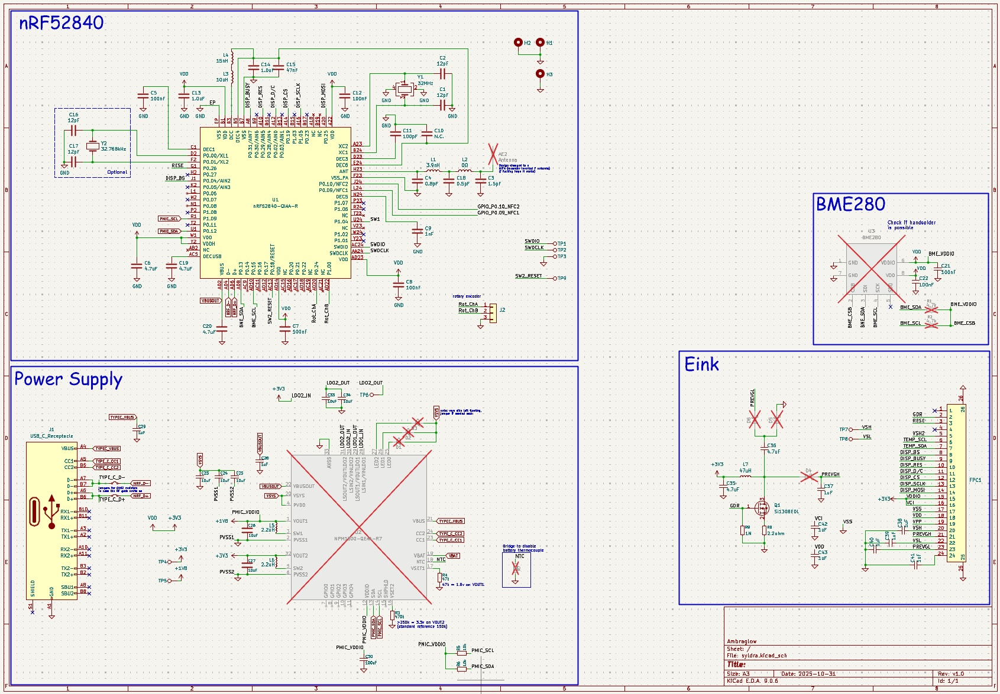
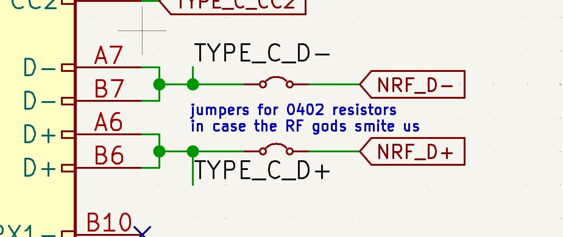
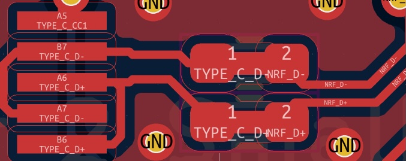
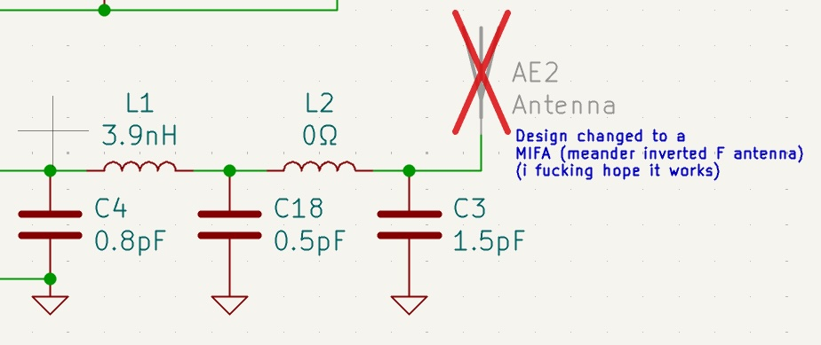
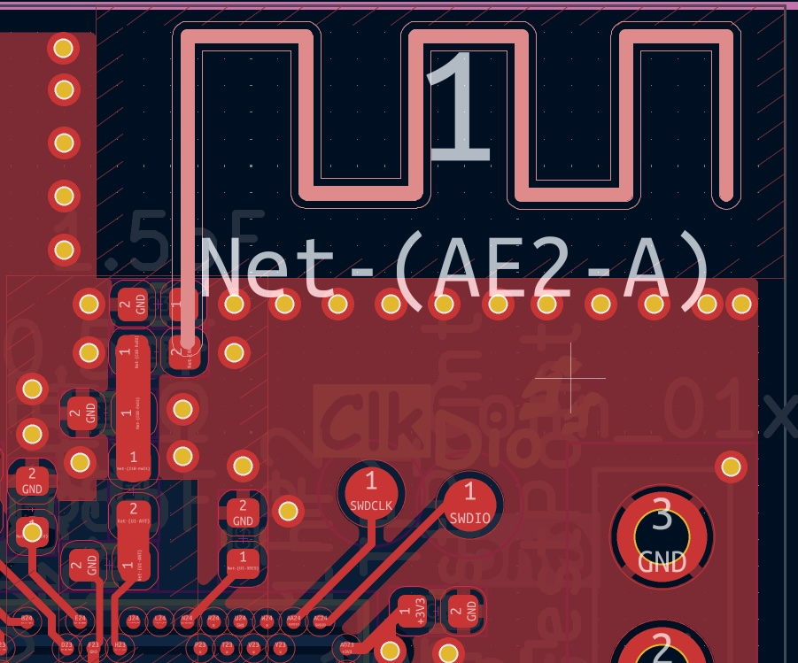
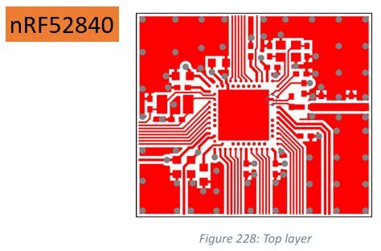

import { Image } from 'astro:assets';
import boardfront from './board-front.png';
import blockdiagram from './block-diagram.png';
import debug from './development-setup.png';
import pcbeditor from './pcbeditor.png';

// design constraints
// debugging hardfault

## hardware design
<Image src={pcbeditor} alt={"screenshot inside the kicad pcb editor of the board"}/>
I ordered these boards right before the holidays in 2025, and i finally got them in my hands in January. I was very excited about this design working out, but after powering and testing the chips i quickly remembered how it felt when i worked with my first design - an RP2040 board and how the first bring-up, especially with a complex layout, will always be stressful and might not go as well as you thought. 
A cute carpenter [frog](https://github.com/localcc) whispered to me the idea, the final doodad will be housed in a small cube, with a temperature-set knob on top, usb-c port on one side for charging, holes on the opposite side for sensors and a cute display at the front. 
When i first started laying out the design on it i knew i would be busy in Kicad for a while, but i didn't realize what i was getting into until i started going through the datasheet of the microcontroller, 
first of all it's a myriad of pages - 980 to be exact - to give you a short introduction: the main star of the show is the NRF52840, one of nordic semiconductors' most popular when it comes to low-power Bluetooth SoCs, the board also features a PMIC (Power management IC) - specifically the NPM1300 which is also by nordic - for power supply and battery charging, a BME280 temperature and humidity sensor, headers for a rotary encoder and lastly, a flex cable connector for the E-ink display. 
Choosing all the components took a while, as ideas kept coming up but it was all built on top of knowing i would use the nrf52840, the rotary encoder and BME280 came later.

Getting back to the main point, we can quickly see why there's so many pages, the block diagram shows us a complete overview of the peripherals present, most of which we'll use, the sections of most interest to me for hardware design and troubleshooting were [Chapter 7 Hardware layout](), [Section 6.35 USBD]() and [Chapter 5 Power and clock management]().

This is how it started, laying out the schematic bit by bit, i usually start with components handling power buses.

In the span of a week and a half i was done, i chose to use a PCB antenna which added some time to the development process and meant i ended up sitting on the choice of sending them into production for a few days.

I divided up the schematic into 4 blocks, one for the nrf, the pmic, sensors and the Eink display connector. 
I took a few precautions like in the case of the resistors on the usb lines needed for impedance and reflections, i crafted a custom footprint for these that is bridged by default and can be adapted as needed:

Here's the antenna on the schematic and PCB:

I kept it as close to Nordic's hardware layout reference as possible:

When the boards arrived in January and i fired them up i found a few issues:
- USB wouldn't work no matter what i tried
- Bluetooth also wouldn't work
- The nRF went into unrecoverable Hardfault
The last point is very important, in this context it points to the point of failure being hardware rather than software, which means i wasn't doing anything wrong with the firmware (makes sense, like what could go wrong with a blink program really?).

## Troubleshooting

<Image src={boardfront} alt={"front side of the board"}/>
My first tests with the board went alright, my setup consisted of an nRF9161-DK as a debugger and a random devboard as a power supply, i did not mention but i chose not to populate the PMIC as well as a few other components so i could cut costs for the first batch, so i had to do with what we have laying around.
<Image src={debug} alt={"nrf9161-dk setup"}/>
I placed various test-points around the board, allowing me to check voltage levels and current consumption on the different power rails. 

## Chasing the power path

![[Pasted image 20260119031847.png|500]]

![[Pasted image 20260118174323.png]]
![[Pasted image 20260118174339.png]]
// Cortex-m core locked up
// Hot-aired one of the boards
// final solution
// going through testing all the boards
// graphing RSSI and writing a parser for BLEHero

