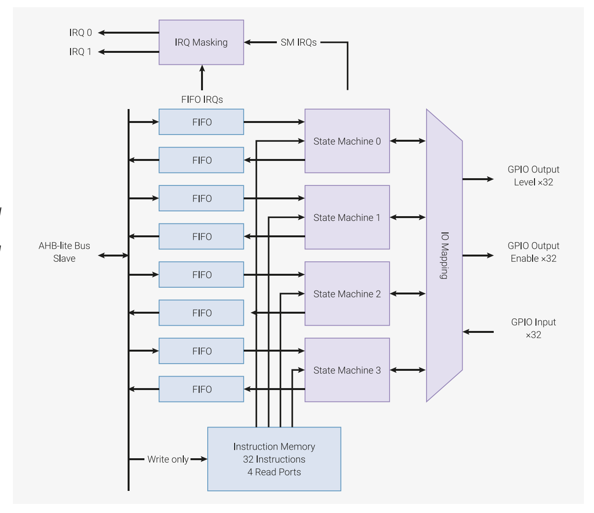

### A disclaimer:
The first section of this post will provide some context about the xbox 360 and how the hacking scene evolved over the years, if you want to go straight to the point jump to [Viper Dual NAND V2 reversing].

# A bit(e) of Xbox 360 history 
The Xbox 360, released by Microsoft in 2005, veers off from its predecessor's design - the original XBOX, which is based on x86 and is similar to a desktop pc of the time - whereas the 360 completely switches architectures, choosing PowerPC instead, and utilizes embedded solutions for its power-path and IO handling. 
Starting from the oldest 360 model, named "Xenon", the image shows the main components from right to left the CPU - nicknamed "XCPU", left of that sits the GPU - named "Xenos", right above is a dedicated ASIC for analog signals called the "[ANA](https://xenonlibrary.com/wiki/ANA)" and next to it is the southbridge which is our I/O controller, also integrating extra facilities such as the flash interface and the "SMC" System Management Controller.

## The first exploits
Plenty of documentation exists - which magically appeared on the internet over the years - detailing the Xbox 360 motherboard, you can find schematics, high-resolution scans and boardviews[^1]. 
Leaked schematics show precisely which signals are present on debug headers and test points which leads to a useful discovery for us, the SMC flash interface meant for factory programming is exposed which means we can hook up a programmer to it! The first modchip to exploit the flash interface, carrying an additional NAND loaded with a custom kernel, came out in 2008 and is released by team Cygnos[^2], about a year after a program was released that allowed dumping and decrypting of the 360's flash memory. 
### NAND flash memory
Before we dive further into modchips, i'd like to expand on flash memory and how it works, specifically in relation to communication with other devices.
Most common in the industry are NOR and NAND flash types, both using floating-gate memory 
technology, NAND was likely chosen for the Xbox due to its faster speeds and low costs.
The power requirements are what you'd expect for a device found in embedded solutions and the like, with logic levels following the same theory and usually around 3.3V or 1.2V/1.8V, sometimes having tolerance for both!
The average pinout consists of various control signals for address input, chip control, read/write commands and a Ready/Busy line, signaling transaction state, useful in case multiple chips are present in a system.
## So, why Tulip?
Since the Cygnos360, numerous "Dualnand" modchips have been made, most of them use the same mechanism by exploiting the NAND control signals using a small microcontroller, some allowing selecting storage between console reboots. "Dualnand" is only half the battle - and not really necessary in principle, as i mentioned earlier "glitch" chips also exist which are essential to modifying the console's behavior and running custom firmware, used to load games or a development environment.
None of the existing "Dualnand" modifications allow for a full "solution" that is also cheap and easy to manufacture, which would include flashing of the onboard NAND and the additional memory, switching and providing an interface for debugging with a computer. 
This is what Tulip is meant to cover - for the "Dualnand" type of modifcation, using existing boards as a starting point, and aiming for a fully open source design.
Existing "Xbox" programmers use FTDI's USB-to-UART/FIFO line of ICs, they allow reading and writing of NAND flash, as well as programming of glitch chips over JTAG - which sounds pretty hard to beat footprint and functionality-wise, but it's not impossible.   
For my design i chose an RP2040, from Raspberry pi foundation's microcontroller line, this tiny beast packs two 32-bit ARM cores, has 264 KB of SRAM and uses external flash to store its programs.
The main reason i chose the RP2040 is one of its peripherals called PIO, the acronym, which stands for Programmable Input/Output tells us a bit about what's going on behind the scenes.
It is divided into two blocks totalling to eight [state machines](https://en.wikipedia.org/wiki/Finite-state_machine), each block has 4 state machines and a bit more going on, as shown in the block diagram present in the [datasheet](https://pip-assets.raspberrypi.com/categories/814-rp2040/documents/RP-008371-DS-1-rp2040-datasheet.pdf):  

Each block is programmable, using its own machine language with 32 instructions of memory meaning programs run independently of the CPU cores. Furthermore the datasheet states that each block has access to DMA, which is great, this means we won't ever have to send an interrupt to our cores!
This whole system is neat as it allows us to do things *very fast* and offload work from the CPU cores, we could use the PIOs to bitbang SPI and flash the xbox, which leaves room for the two cores to handle USB and other tasks for example!

## Reversing and design constraints

Our work begins with reversing the Viper Dual NAND v2, the board looks quite barebones but 
there's a lot going on here, to start off let's list the components:

- U1 is clearly the NAND flash memory IC in TSOP-48 Pin package
- U2 is a microcontroller, in SOIC-8 package
- U3 is is likely a linear voltage regulator
- Q1, a BJT transistor

we can quite clearly see the traces utilized by the NAND and what signals they carry - as they're labelled accordingly, IO/* signals are parallel data lines, and the rest are signals used to control transactions between the console and the memory chip.
The main power is drawn from the console itself, specifically from the 3.3v standby line - always active even before power-on, U3 is placed in case we're powering a glitch chip which is only necessary in older console revisions.

In my design, i kept the viper v2's general ideas and expanded on them as needed, starting with the RP2040 which will handle all the flashing tasks interacting with both the onboard NAND and the modchip's NAND. I added flash memory for the rp2040, an LED for debugging, a reset button and a power LED.

You can clearly see the compromises i had to make due to the board being taller, i've broken out UART/USB and SWDIO to test points, and the holes in the board aren't there just for show as they're making space for components present on the Xbox mainboard. While working on the board i placed a high-resolution scan of the xbox 360 below the layout as an aid for this purpose, and to adjust the solder points along the bottom. Switching between the NAND chips is kept isolated from the microcontroller through the use of a PNP transistor. 

## The first revision
The first revision of the board, didn't go as planned.

// forgot uart pads :sob:
// scrapped dinosaur revision (for easier soldering)

[^1]: A PCB layout file, opened by specialized software, which contains information about its components, used signals and their names, test points and more
[^2]: http://www.cygnos360.com/