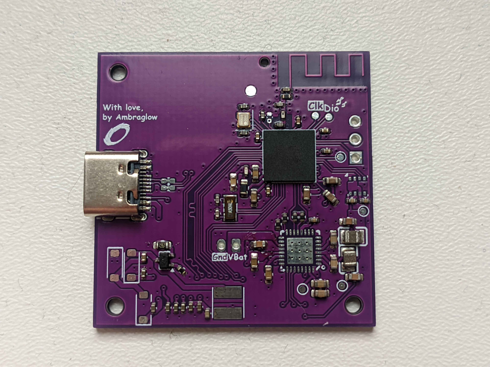

Custom made nrf52840 board, tailored for fitting in a box case, meant to function as a room thermostat, with home-assistant integration, a cute E-Ink screen for displaying data, a knob for setting target temperature and sensors for periodic measurements.

