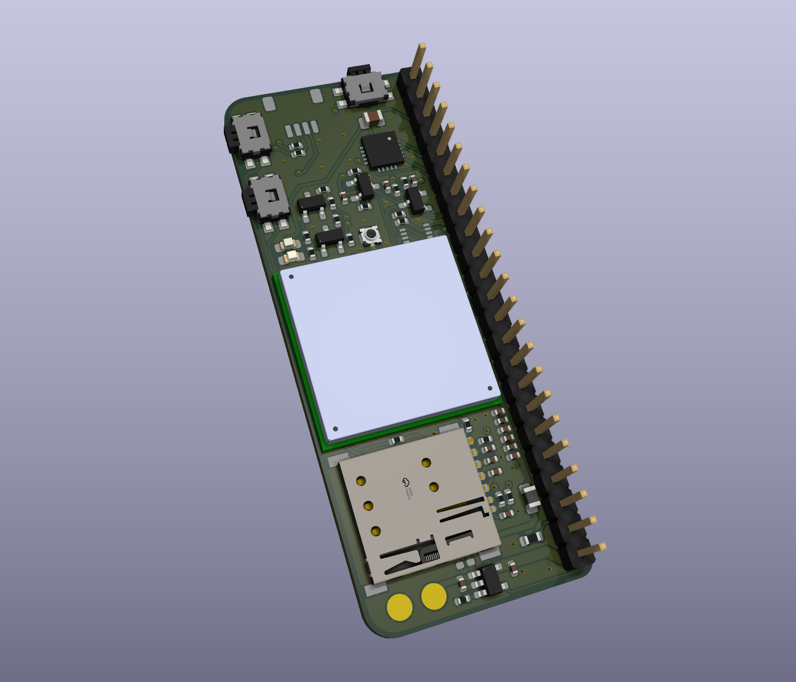

LTE modem addon for the [Beepis](https://bbkb-community.github.io/computers/beepis/) handheld computer, single sim-card slot and an antenna connector, pads speaker and microphone underneath the board. 

