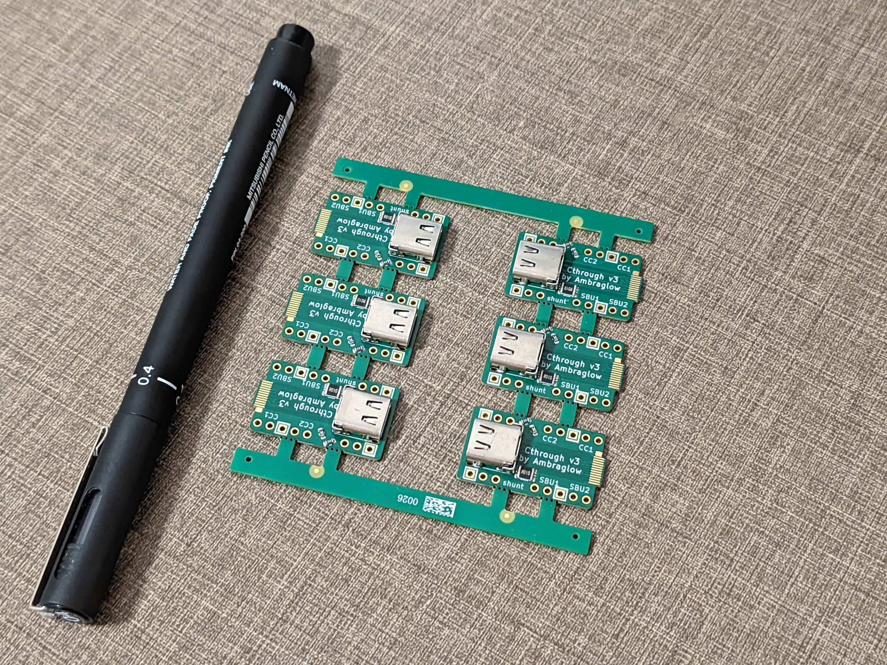
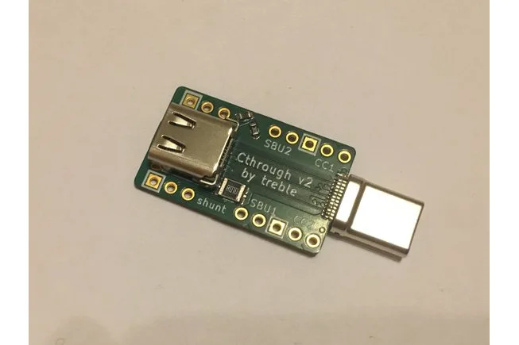

The USB-Cthrough helps you tap into USB-C Power Delivery and EPR (high-voltage) communications, DisplayPort, proprietary protocols, and even Thunderbolt negotiations without any issues! It's featureful, USB-C standard compliant, upgradeable, designed and tested for high-speed interface use.

